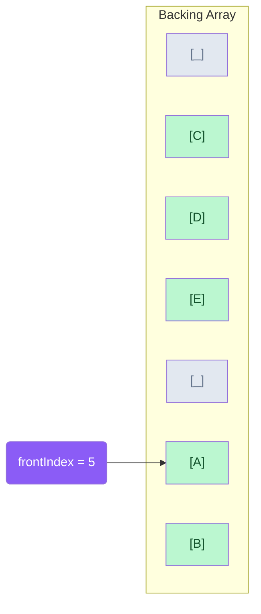
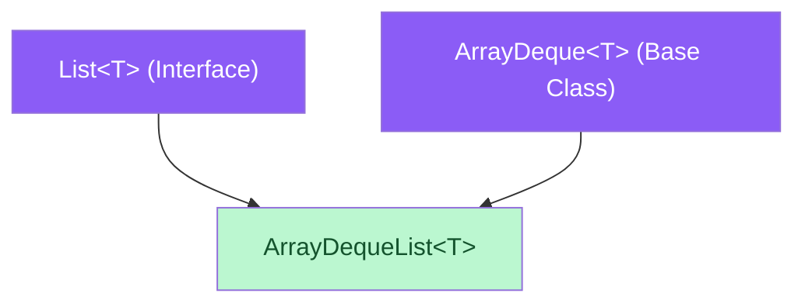
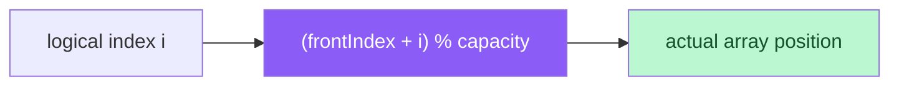
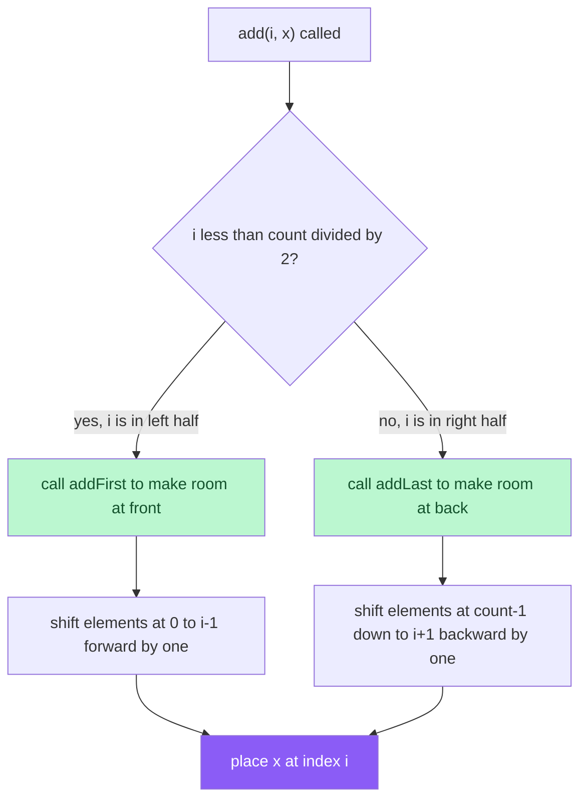
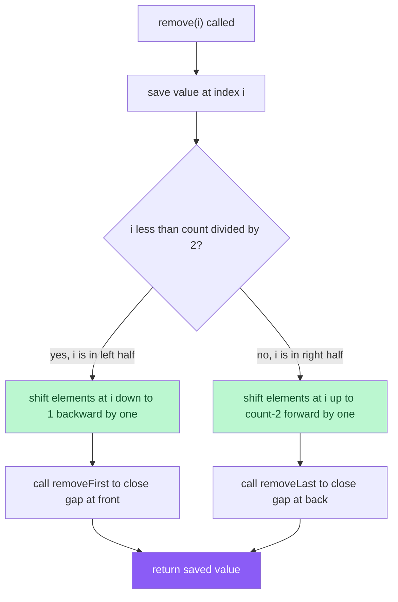
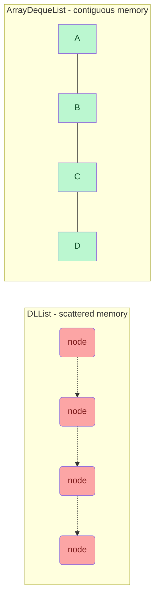
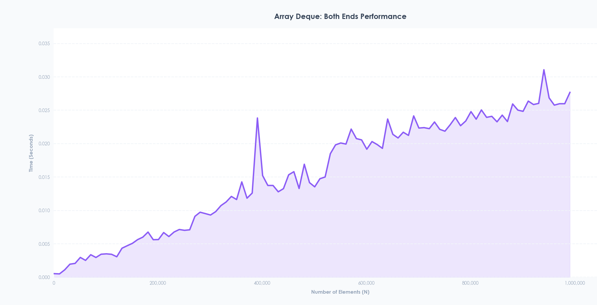

# ArrayDequeList Implementation Guide

### 1. Overview of ArrayDequeList
The `ArrayDequeList` is a concrete Data Structure that implements a List (index-based access) by **extending** the `ArrayDeque` class — reusing its circular array as the underlying physical building material. Unlike the `DLList` which allocates individual nodes on the heap, the `ArrayDequeList` stores all elements in one contiguous block of memory, making it significantly more cache-friendly and faster in practice.

### 2. Architectural Components
The `ArrayDequeList` builds on top of two existing components and adds the List interface on top.

#### A. The `List` Interface ([`list.hpp`](./Interfaces/list.hpp))
`ArrayDequeList` inherits from `List<T>`, promising index-based access:
* `get(int i)`: Returns the element at index i.
* `set(int i, T x)`: Replaces the element at index i with x, returns the old value.
* `add(int i, T x)`: Inserts x at index i, shifting elements to the right.
* `remove(int i)`: Removes and returns the element at index i.
* `size()`: Returns the number of elements in the list.

#### B. The `ArrayDeque` Base Class ([`array_deque.cpp`](./Implementations/array_deque.cpp))
`ArrayDequeList` also extends `ArrayDeque`, inheriting its circular buffer and reusing its operations:
* `addFirst(x)` / `addLast(x)` — O(1) amortized insertion at either end
* `removeFirst()` / `removeLast()` — O(1) amortized removal from either end
* `resize()` — dynamic growth and shrinking of the backing array
* `frontIndex` — the starting index of the circular buffer
* `count` — number of elements currently stored
* `a` — the backing `array<T>` struct

#### C. The Circular Buffer
The backing array is not a straight array — it wraps around. `frontIndex` marks where the data starts, and elements are accessed using the circular index formula:

```
actual position = (frontIndex + i) % capacity
```



Logical order: A → B → C → D → E (wraps around the array boundary)

#### D. Inheritance Hierarchy


---

### 3. Deep Dive into `ArrayDequeList` Logic ([`array_deque_list.cpp`](./Implementations/array_deque_list.cpp))
The `ArrayDequeList` inherits all member variables from `ArrayDeque` — `a`, `frontIndex`, and `count` — and adds the four List operations on top.

#### The Circular Index Formula
Every List operation relies on this formula to convert a logical index `i` into an actual position in the backing array:



#### `get(i)` and `set(i, x)` — O(1)
Both are pure index math — no traversal needed:

```cpp
// get
return a.a[(frontIndex + i) % a.length];

// set
int idx = (frontIndex + i) % a.length;
T old = a.a[idx];
a.a[idx] = x;
return old;
```

This is the biggest advantage over `DLList` — accessing any element is instant regardless of where it is in the list.

#### `add(i, x)` — O(1 + min(i, n-i))
Instead of shifting the entire array, only the **smaller half** is shifted:



Example — `add(1, X)` with elements `[A, B, C, D]`, i=1 is in the left half so shift left:
```
Before: [ A | B | C | D ]
         0   1   2   3

Step 1: addFirst makes room → [ _ | A | B | C | D ]
Step 2: shift 0..0 forward  → [ A | A | B | C | D ]
Step 3: place X at index 1  → [ A | X | B | C | D ]
```

#### `remove(i)` — O(1 + min(i, n-i))
Mirror of `add` — shifts only the smaller half to close the gap:



---

### 4. ArrayDequeList vs DLList
Both implement the same `List` ADT but with very different tradeoffs:

| Operation | ArrayDequeList | DLList |
|---|---|---|
| `get(i)` | O(1) — index math | O(n) — must traverse |
| `set(i, x)` | O(1) — index math | O(n) — must traverse |
| `add(i, x)` | O(min(i, n-i)) — shift half | O(min(i, n-i)) — traverse + relink |
| `remove(i)` | O(min(i, n-i)) — shift half | O(min(i, n-i)) — traverse + relink |
| Memory | One contiguous block | One node per element |
| Cache friendly | ✅ Yes | ❌ No |



---

### 5. Performance Testing and Benchmarking
To validate the efficiency of the `ArrayDequeList`, the project includes a specialized benchmarking suite.

* **The C++ Benchmark ([`benchmark.cpp`](./Benchmarking/benchmark.cpp)):** The `benchmarkArrayDequeList` function tests the full add + get + remove cycle. It loops through `N` elements, starting from 1,000 up to 1,000,000 in increments of 10,000. For each `N`, it adds `N` elements, gets all `N` elements, then removes all `N` from the front, recording total time using `std::chrono::high_resolution_clock` and outputting as `N,duration`.
* **Live Data Visualization ([`live_graph.py`](./Benchmarking/live_graph.py)):** The data is piped into a Python script via `subprocess.Popen`, animating a live graph of the performance curve as N scales up.

---

### 6. Observed Performance Characteristics
The `ArrayDequeList` is expected to outperform `DLList` significantly due to cache locality:




* **Smooth linear growth:** Since all elements are in one contiguous array, the CPU cache can prefetch data efficiently — far fewer cache misses than DLList.
* **Reallocation spikes:** When the backing array doubles in size, all elements must be copied to the new array — causing occasional spikes similar to the ArrayStack.
* **Final comparison of all List implementations:**

| Structure | `get(i)` | Memory | Cache | Spikes from |
|---|---|---|---|---|
| ArrayDequeList | O(1) | Contiguous | ✅ Yes | Resize |
| DLList | O(n) | Scattered | ❌ No | Heap fragmentation |