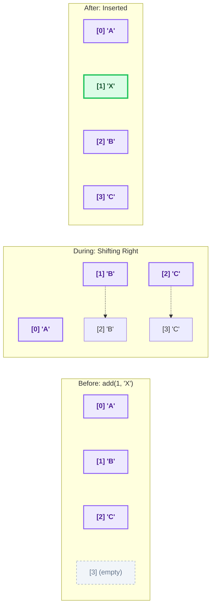
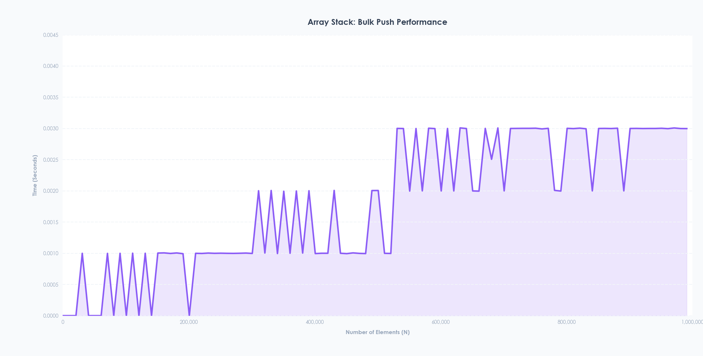

# ArrayStack

### 1. Overview of ArrayStack
The `ArrayStack` is a concrete Data Structure that implements a Stack (Last-In-First-Out) using a contiguous block of memory a dynamic array as its underlying physical building material. 

### 2. Architectural Components
The `ArrayStack` relies on a custom base array for memory management and a strict interface to ensure standardization across different data structures in the repository.

#### A. The `List` Interface ([`list.hpp`](./Interfaces/list.hpp))
`ArrayStack` inherits from a generic template interface class called `List<T>`. This interface dictates that any conforming list-like structure must implement the following core methods:
* `size()`: Returns the number of elements.
* `get(int i)` and `set(int i, T x)`: Retrieves and updates elements at specific indices.
* `add(int i, T x)` and `remove(int i)`: Inserts and deletes elements at specific positions.

#### B. Raw Memory Management ([`array.cpp`](./Base_Structures/array.cpp))
Instead of relying on the C++ Standard Template Library (`std::vector`), the implementation utilizes a custom dynamic array struct `array<T>` to manage memory manually.
* **Allocation & Cleanup:** The constructor takes an integer `len` and allocates a raw array on the heap using `new T[length]`. To prevent memory leaks, the destructor explicitly frees this memory using `delete[] a`.
* **The Copy Helper:** Because raw arrays cannot be resized once created, migrating data to a new array is necessary when the stack grows or shrinks. The struct provides a static `copy` method that uses `std::copy` to efficiently transfer elements from a source array to a destination array.

---

### 3. Deep Dive into `ArrayStack` Logic ([`arraystack.cpp`](./Implementations/arraystack.cpp))
The `ArrayStack` class maintains two critical variables: a custom `array<T> a` (the backing array) and an integer `n` (the current number of elements). It initializes with a capacity of 1 and 0 elements (`n = 0`).

#### The `resize()` Mechanism
Because arrays are fixed-size in C++, the `ArrayStack` must dynamically manage its capacity.
* When triggered, `resize()` creates a new array `b` with double the current capacity (`std::max(1, 2 * n)`). 
* It copies the `n` existing elements from array `a` to array `b` using the helper function.
* Finally, it swaps the internal pointers and length values using `std::swap`, safely replacing the old array with the newly expanded (or shrunken) one.

#### List Operations: `add` and `remove`
The stack relies heavily on these two generalized list operations:
* **`add(int i, T x)`:** First, it performs bounds checking, throwing an `out_of_range` error if `i` is invalid. If inserting the new element exceeds the array's capacity (`n + 1 > a.length`), it calls `resize()`. To insert at index `i`, it iterates backwards from `n` down to `i`, shifting every element one position to the right (`a.a[j] = a.a[j - 1]`) to create an empty slot before inserting `x` and incrementing `n`.
* **`remove(int i)`:** After extracting the target element, this method shifts all elements starting from `i` to the left (`a.a[j] = a.a[j + 1]`) to fill the gap left by the removed item. After decrementing `n`, it checks for under-utilization; if the total capacity is three times larger than the number of active elements (`a.length >= 3 * n`), it calls `resize()` to shrink the array and save memory.

#### Visualizing `add(int i, T x)` and Element Shifting
When inserting an element into the middle of the array, all subsequent elements must physically shift one space to the right to make room.

#### Stack Operations: `push` and `pop`
The core stack operations utilize the generic list methods in a way that makes them highly efficient:
* **`push(T x)`:** This method calls `add(n, x)`. Because it inserts the element exactly at index `n` (the very end of the populated elements, or the "Top" of the stack), the shifting loop inside the `add` method is entirely bypassed.
* **`pop()`:** If the stack is empty, it throws an `out_of_range` error. Otherwise, it calls `remove(n - 1)` to extract the element at the top of the stack. Because it removes the very last element, no left-shifting is required in the `remove` method.

---

### 4. Performance Testing and Benchmarking
To validate the efficiency of the `ArrayStack`, the project includes a specialized benchmarking suite.

* **The C++ Benchmark ([`benchmark.cpp`](./Benchmarking/benchmark.cpp)):** The `benchmarkArrayStack` function is designed to test the structure's bulk push performance. It loops through `N` elements, starting from 1,000 up to 1,000,000 in increments of 1,000. For each `N`, it records the exact time it takes to push `N` elements into a fresh `ArrayStack` using `std::chrono::high_resolution_clock`, and outputs the results as comma-separated values (`N,duration`).
* **Live Data Visualization ([`live_graph.py`](./Benchmarking/live_graph.py)):** The data generated by the C++ executable is piped into a Python script. This script reads the input via `sys.stdin.readline()`, parsing the `N` and time values. Using `matplotlib`, it animates a live graph that visually plots the time complexity and performance curve as the elements scale up to 1 million.

  

**What this graph tells us about the code:**
* **The Flat Trendline:** Despite pushing a massive number of elements, the average time per insertion remains flat and constant. This visually proves the **$O(1)$ amortized time complexity** for the `push()` operation.
* **The Spikes (Capacity Reached):** If you look at the raw data points, you might notice occasional, predictable spikes in execution time. These spikes represent the exact moments the internal `array<T>` runs out of space and triggers the `resize()` function.
* **Amortized Efficiency:** Because the array strictly *doubles* in size during a resize, these expensive $O(n)$ copying operations happen less and less frequently as the stack grows. When you average out the heavy cost of resizing over millions of fast $O(1)$ pushes, the overall penalty approaches zero—keeping our trendline perfectly flat!
