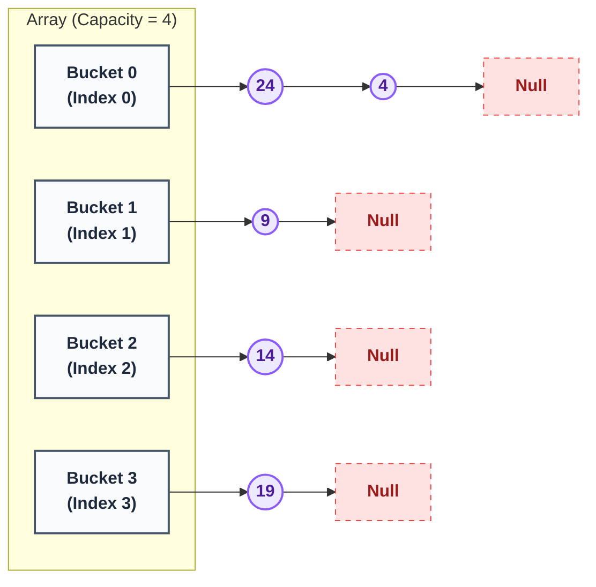
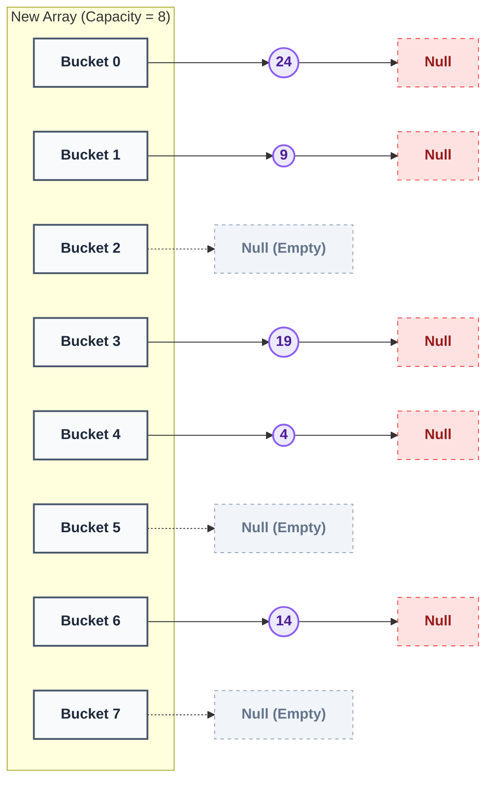

# Chained Hash Set (Unsorted Set)

The `ChainedHashSet` is an implementation of the `SSet` (Set) interface using a chained hash table. Unlike the `Skiplist`, this structure does not maintain its elements in any sorted order. Instead, it optimizes for blistering speed, providing constant average-time lookups, insertions, and deletions.

## Theoretical Performance (Theorem 5.1)

This implementation adheres to the performance characteristics outlined in Open Data Structures (Theorem 5.1):

* **Expected Time:** Ignoring the cost of dynamic resizing, the operations `add(x)`, `remove(x)`, and `contains(x)` run in $O(1)$ expected time.
* **Amortized Resizing:** Beginning with an empty `ChainedHashSet`, any sequence of $m$ `add(x)` and `remove(x)` operations results in a total of $O(m)$ time spent during all calls to `resize()`. This means the amortized cost of resizing per operation is also $O(1)$.
* **Space Complexity:** The table dynamically shrinks and grows to ensure the space used is always $O(n)$, where $n$ is the number of elements in the set.

## Implementation Details

The data structure relies on an array (implemented via `std::vector`) of "buckets." Each bucket points to the head of a singly linked list (`HashNode`). 

1.  **Hashing:** It uses C++'s built-in `std::hash<T>` to map arbitrary types to an integer, then uses modulo arithmetic (`hash % capacity`) to place the element in a specific bucket.
2.  **Handling Collisions (Chaining):** If two elements hash to the same bucket, the new element is simply prepended to the linked list at that bucket. 
3.  **Dynamic Growing:** To maintain $O(1)$ expected lookup times, the hash table tracks its "load factor." If adding an element would cause the number of elements ($n$) to exceed the number of buckets (`capacity`), the table doubles in size and rehashes all existing elements.
4.  **Dynamic Shrinking:** To prevent memory waste, if elements are heavily removed and the table becomes less than one-third full ($3n < capacity$), the table halves its capacity.


#### State 1: Before Resize (High Collision)
Imagine we have a hash table with a Capacity of 4. We have added five numbers: 4, 9, 14, 19, 24.
Because we use Hash(X) = X % 4, notice how the numbers 4 and 24 both end up in Bucket 0, creating a chain.


#### State 2: After Resize (Data Redistributed)
In the state above, our load factor exceeded 1.0 (5 items > 4 capacity). The resize() function is triggered, doubling the array size to Capacity 8.

Look at what happens to the data. Every single number is recalculated using Hash(X) = X % 8. The collision in Bucket 0 is resolved because 24 % 8 = 0 but 4 % 8 = 4. The data is physically unlinked and moved to new memory locations, breaking up the long chains!



If you look closely at these diagrams, you can see the two distinct layers of data storage that make up this structure:

The Left Column (The std::vector): This data is stored in contiguous memory. The CPU can instantly jump to table[6] in $O(1)$ time without searching.The Horizontal Rows (The Linked Lists): These nodes are allocated in heap memory using the new keyword. They are scattered randomly in RAM, connected only by their ->next pointers. This allows multiple items to safely share a bucket without overwriting each other.


## Running the Unit Tests

A comprehensive unit test suite verifies the core logic, duplicate prevention, and memory-safe dynamic resizing.

**To compile and run the tests:**
```bash
g++ -o Tests/hash_test.exe Tests/chained_hash_set_test.cpp
./Tests/hash_test.exe
```