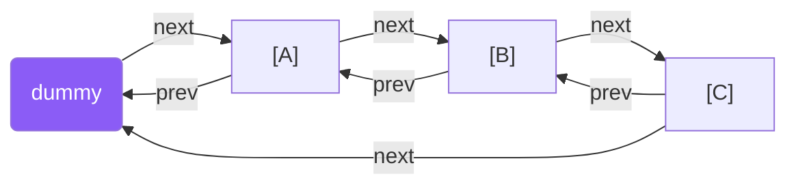
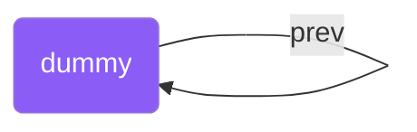
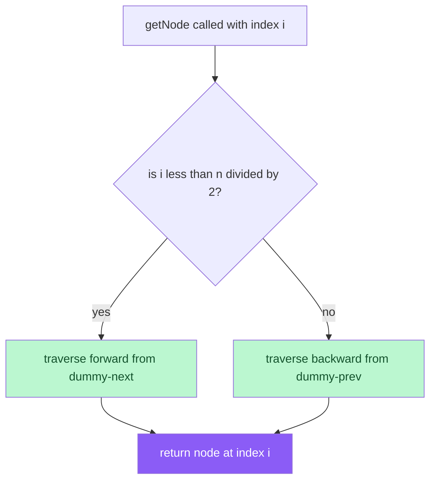
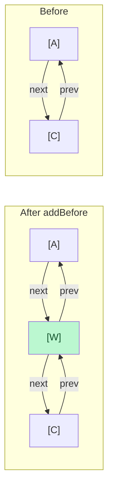
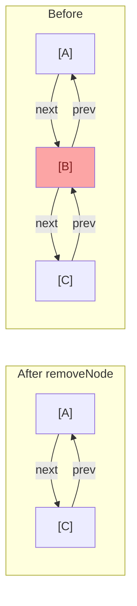
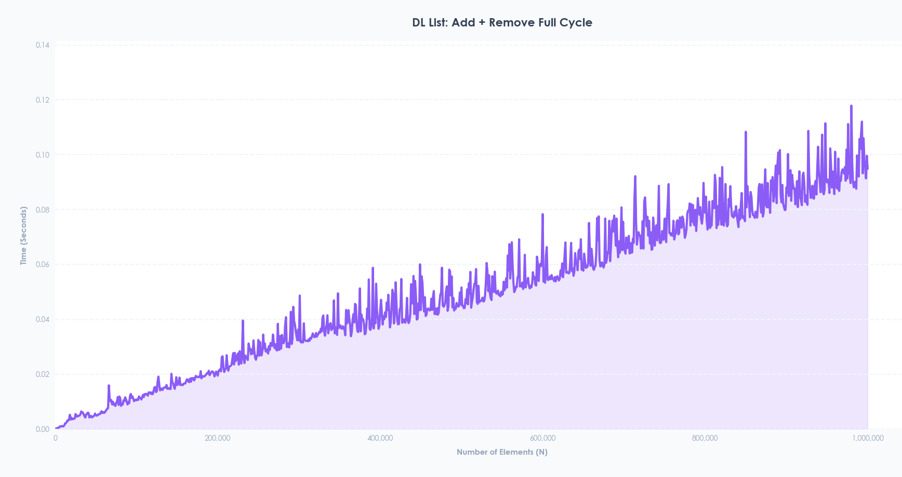

# DLList Implementation Guide

### 1. Overview of DLList
The `DLList` is a concrete Data Structure that implements a List (index-based access) using a Doubly Linked List as its underlying physical building material. Unlike a Singly Linked List, each node holds two pointers — `next` and `prev` — allowing traversal in both directions. This bidirectional traversal enables an optimization where any index can be reached from whichever end is closer.

### 2. Architectural Components
The `DLList` relies on a custom node struct for memory management and a strict interface to ensure standardization across different data structures in the repository.

#### A. The `List` Interface ([`list.hpp`](./Interfaces/list.hpp))
`DLList` inherits from a generic template interface class called `List<T>`. This interface dictates that any conforming list-like structure must implement the following core methods:
* `get(int i)`: Returns the element at index i.
* `set(int i, T x)`: Replaces the element at index i with x, returns the old value.
* `add(int i, T x)`: Inserts x at index i, shifting elements to the right.
* `remove(int i)`: Removes and returns the element at index i.
* `size()`: Returns the number of elements in the list.

#### B. Node-Based Memory Management ([`dll_node.hpp`](./Base_Structures/dll_node.hpp))
Instead of relying on a contiguous array, the `DLList` uses a custom `DLLNode<T>` struct to manage memory dynamically. Each node is individually allocated on the heap.
* **Structure:** Each `DLLNode` holds a `value` of type `T`, a `next` pointer to the next node, and a `prev` pointer to the previous node.
* **Allocation & Cleanup:** Nodes are created with `new DLLNode<T>(x)` during `add` and freed with `delete` during `remove`. The destructor walks the entire list to free all nodes including the dummy sentinel.

#### C. Basic Structure
The list uses a circular dummy sentinel node — `dummy->next` points to the first real node and `dummy->prev` points to the last:

---

### 3. Deep Dive into `DLList` Logic ([`dll_list.cpp`](./Implementations/dll_list.cpp))
The `DLList` class maintains two critical variables: a `dummy` sentinel node and an integer `n` (the current number of elements). It initializes with `dummy->next` and `dummy->prev` both pointing to `dummy` itself (circular empty list).

#### The Dummy Sentinel Node
The key design decision in `DLList` is using a **dummy/sentinel head node**:
* The dummy node is always present and holds no real data.
* It eliminates all edge cases for inserting or removing at index 0 — `dummy` is always the predecessor of the first real node.
* An empty list looks like this:

#### The `getNode(i)` Helper
Before any operation can be performed, the node at index `i` must be located. The `getNode` method optimizes traversal by approaching from whichever end is closer:

#### The `addBefore(u, w)` Helper
Inserting a new node `w` before an existing node `u` requires updating exactly 4 pointers:

The four pointer updates in order:
1. `w->prev = u->prev` — w's prev points to u's old prev
2. `w->next = u` — w's next points to u
3. `w->prev->next = w` — u's old prev now points forward to w
4. `u->prev = w` — u's prev now points back to w

#### The `removeNode(u)` Helper
Removing a node `u` requires bridging its neighbors together then deleting it:

#### Core Operations
* **`get(i)`:** Calls `getNode(i)` and returns its value. O(1 + min(i, n-i)).
* **`set(i, x)`:** Calls `getNode(i)`, saves the old value, overwrites with x, returns old value. O(1 + min(i, n-i)).
* **`add(i, x)`:** Creates a new node, calls `addBefore(getNode(i), newNode)`. O(1 + min(i, n-i)).
* **`remove(i)`:** Calls `getNode(i)`, saves value, calls `removeNode(u)`, returns saved value. O(1 + min(i, n-i)).

---

### 4. Performance Testing and Benchmarking
To validate the efficiency of the `DLList`, the project includes a specialized benchmarking suite.

* **The C++ Benchmark ([`benchmark.cpp`](./Benchmarking/benchmark.cpp)):** The `benchmarkDLList` function tests the structure's full add + remove cycle performance. It loops through `N` elements, starting from 1,000 up to 1,000,000 in increments of 1,000. For each `N`, it records the exact time it takes to add `N` elements to the back and then remove all of them from the front, using `std::chrono::high_resolution_clock`, and outputs the results as comma-separated values (`N,duration`).
* **Live Data Visualization ([`live_graph.py`](./Benchmarking/live_graph.py)):** The data generated by the C++ executable is piped into a Python script via `subprocess.Popen`. This script reads the output line by line, parsing the `N` and time values. Using `matplotlib`, it animates a live graph that visually plots the time complexity and performance curve as the elements scale up to 1 million.

---

### 5. Observed Performance Characteristics
Based on benchmark results, the `DLList` exhibits the following behavior:

* **Linear growth (0 to ~500,000 elements):** Time increases steadily — `add(i, i)` requires traversal to index `i` each time, so cumulative time grows as O(n²) in total but appears linear per iteration.
* **Heap fragmentation (500,000 to 800,000 elements):** Each node is individually allocated, scattering memory across the heap. At large N this causes cache misses, OS memory management overhead, and significant spikes.
* **Comparison with SLLQueue and ArrayStack:**

| Structure | Max Time | Cache Friendly | Cause of Spikes |
|---|---|---|---|
| ArrayStack | ~0.005s | ✅ Yes | Reallocation |
| SLLQueue | ~0.12s | ❌ No | Heap fragmentation |
| DLList | ~0.175s | ❌ No | Heap fragmentation |

* **DLList is slower than SLLQueue** because each node has two pointers (`prev` + `next`) instead of one, using more memory per node, and `add(i, i)` traverses to index `i` every iteration — O(n) per insertion — unlike the O(1) enqueue of the SLLQueue.