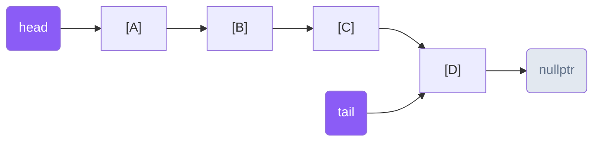
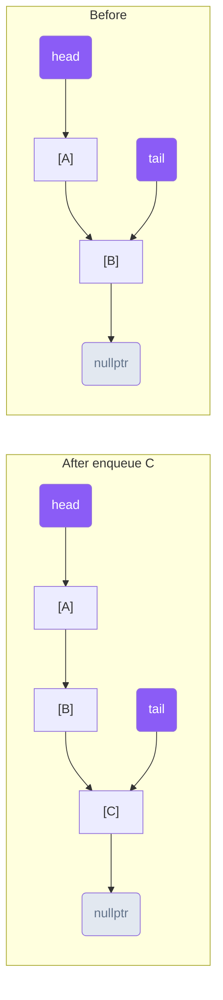
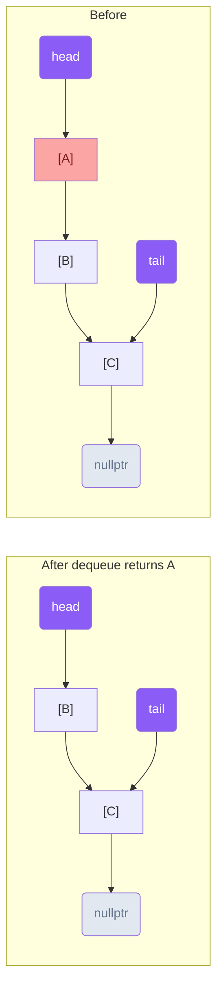
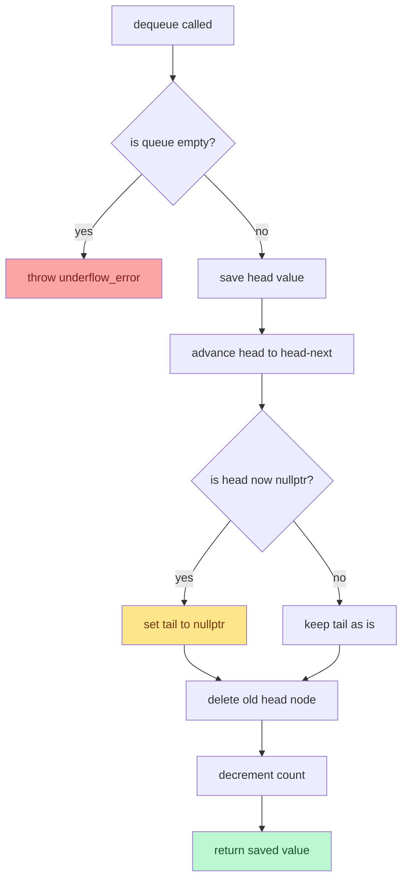
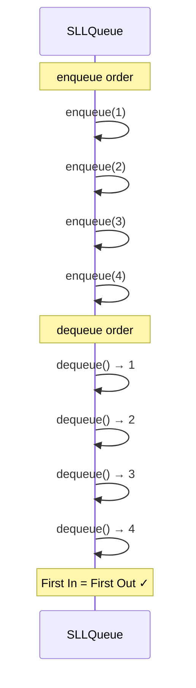
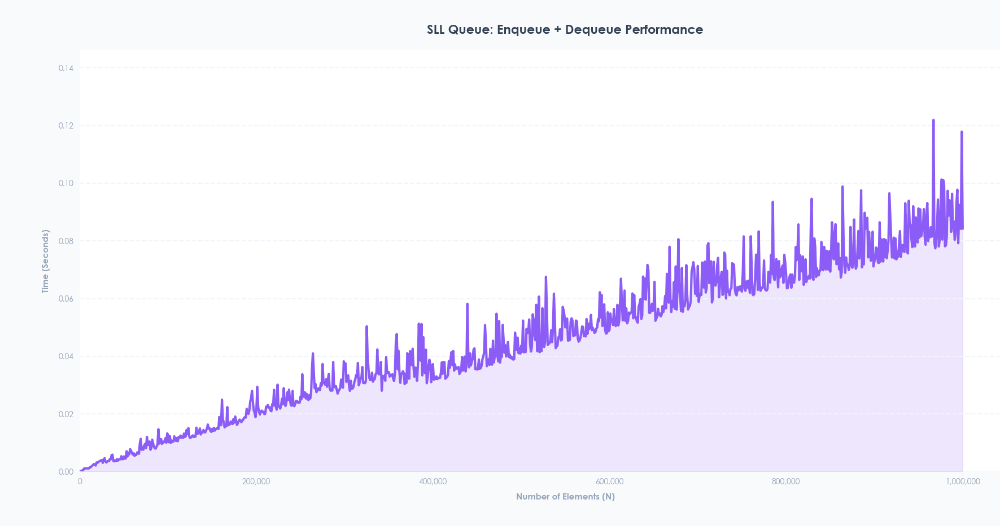

# SLLQueue Implementation Guide

### 1. Overview of SLLQueue
The `SLLQueue` is a concrete Data Structure that implements a Queue (First-In-First-Out) using a Singly Linked List as its underlying physical building material. Unlike array-based structures, it does not require a contiguous block of memory — instead, elements are stored in individually allocated nodes that are chained together via pointers.

### 2. Architectural Components
The `SLLQueue` relies on a custom node struct for memory management and a strict interface to ensure standardization across different data structures in the repository.

#### A. The `Queue` Interface ([`queue.hpp`](./Interfaces/queue.hpp))
`SLLQueue` inherits from a generic template interface class called `Queue<T>`. This interface dictates that any conforming queue-like structure must implement the following core methods:
* `enqueue(T data)`: Adds an element to the back of the queue.
* `dequeue()`: Removes and returns the element at the front of the queue.
* `peek()`: Returns (without removing) the element at the front of the queue.
* `isEmpty()`: Returns true if the queue contains no elements.
* `size()`: Returns the number of elements currently in the queue.

#### B. Node-Based Memory Management ([`sll_node.hpp`](./Base_Structures/sll_node.hpp))
Instead of relying on a contiguous array, the `SLLQueue` uses a custom `SLLNode<T>` struct to manage memory dynamically. Each node is individually allocated on the heap.
* **Structure:** Each `SLLNode` holds a `value` of type `T` and a `next` pointer to the next node in the chain.



* **Allocation & Cleanup:** Nodes are created with `new SLLNode<T>(data)` during `enqueue` and freed with `delete` during `dequeue`. The destructor drains the entire queue to ensure no memory leaks remain.
* **No Resizing Needed:** Unlike array-based structures, linked lists never need to resize — each new element simply allocates a new node on the heap.

---

### 3. Deep Dive into `SLLQueue` Logic ([`sll_queue.cpp`](./Implementations/sll_queue.cpp))
The `SLLQueue` class maintains three critical variables: a `head` pointer (the front of the queue), a `tail` pointer (the back of the queue), and an integer `count` (the current number of elements). It initializes with `head` and `tail` both set to `nullptr` and `count` set to 0.

#### The Two-Pointer Strategy
The key design decision in `SLLQueue` is maintaining both a `head` and a `tail` pointer:
* **`head`** always points to the front node — the next one to be dequeued.
* **`tail`** always points to the back node — where the next enqueued element will be appended.
* Without the `tail` pointer, `enqueue` would require traversing the entire chain to reach the end, making it O(n). With `tail`, both `enqueue` and `dequeue` are O(1).

#### Core Operations: `enqueue` and `dequeue`
The queue relies on these two operations to maintain FIFO order:
* **`enqueue(T data)`:** A new node is created and appended to the back. If the queue was empty, both `head` and `tail` are set to the new node. Otherwise, `tail->next` is linked to the new node and `tail` is advanced forward. `count` is incremented.


* **`dequeue()`:** If the queue is empty, an `std::underflow_error` is thrown. Otherwise, the `head` value is saved, `head` is advanced to `head->next`, and the old head node is deleted. A critical edge case: if advancing `head` results in `nullptr` (the queue is now empty), `tail` must also be set to `nullptr` — otherwise it dangles to a deleted node. `count` is decremented and the saved value is returned.


#### The Edge Case: Last Element Removal
When the last element is dequeued, both `head` and `tail` must be nulled out:
```cpp
head = head->next;       // head becomes nullptr (last element removed)
if (head == nullptr) {
    tail = nullptr;      // tail must also be cleared to avoid a dangling pointer
}
```

Without this check, `tail` would still point to the deleted node, causing undefined behavior on the next `enqueue`.

---

### FIFO Order Visualization


### 4. Performance Testing and Benchmarking
To validate the efficiency of the `SLLQueue`, the project includes a specialized benchmarking suite.

* **The C++ Benchmark ([`benchmark.cpp`](./Benchmarking/benchmark.cpp)):** The `benchmarkSLLQueue` function tests the structure's full enqueue + dequeue cycle performance. It loops through `N` elements, starting from 1,000 up to 1,000,000 in increments of 1,000. For each `N`, it records the exact time it takes to enqueue `N` elements into a fresh `SLLQueue` and then dequeue all of them, using `std::chrono::high_resolution_clock`, and outputs the results as comma-separated values (`N,duration`).
* **Live Data Visualization ([`live_graph.py`](./Benchmarking/live_graph.py)):** The data generated by the C++ executable is piped into a Python script via `subprocess.Popen`. This script reads the output line by line, parsing the `N` and time values. Using `matplotlib`, it animates a live graph that visually plots the time complexity and performance curve as the elements scale up to 1 million.

---

### 5. Observed Performance Characteristics
Based on benchmark results, the `SLLQueue` exhibits the following behavior:



* **Linear growth (0 to ~450,000 elements):** Time increases steadily as expected from O(n) total work — each enqueue and dequeue is O(1) but cumulative time grows linearly with N.
* **Heap fragmentation (450,000 to 800,000 elements):** Unlike array-based structures that allocate one contiguous block, the `SLLQueue` allocates one node per element. At large N, this scatters memory across the heap causing cache misses and OS memory management overhead, resulting in increased variance and spikes.
* **Cache locality disadvantage:** Compared to the `ArrayStack`, the `SLLQueue` is approximately 26x slower at peak due to poor cache locality — nodes are scattered in memory rather than stored contiguously.