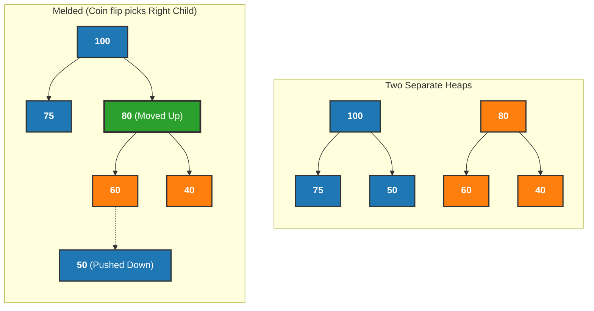
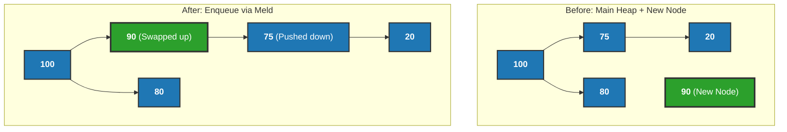
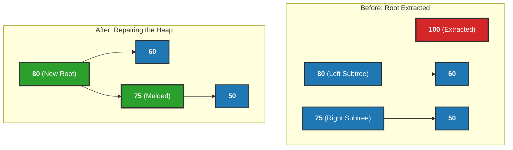

# Meldable Heap Implementation Guide

### 1. Overview of Meldable Heap
A `MeldableHeap` is a highly specialized implementation of a Priority Queue. While standard priority queues strictly process items based on priority order (highest priority leaves first), a Meldable Heap offers a unique and powerful capability: **the ability to take two entirely separate heaps and merge (or "meld") them together in incredibly fast $O(\log N)$ time.**

To achieve this performance, the implementation moves away from the traditional contiguous array. Instead, it utilizes a node-based binary tree structure scattered in memory. Specifically, this repository implements a **Randomized Meldable Max-Heap**, which uses a virtual "coin flip" to maintain tree balance.

### 2. Architectural Components
The `MeldableHeap` integrates into the repository's ecosystem by swapping out the underlying memory manager while keeping the public contract exactly the same.

* **The `Queue` Interface:** The structure fully conforms to the generic `Queue<T>` interface. This guarantees it adheres to the standardized contract, implementing `enqueue`, `dequeue`, `peek`, `isEmpty`, and `size`.
* **The Binary Node (`bt_node.hpp`):** Unlike an array-based heap, this structure utilizes standard tree nodes. Each `BTNode` holds a generic data value and two memory pointers (`left` and `right`) that connect to its children.

---

### 3. Core Logic: The `meld` Operation

In a Meldable Heap, every primary operation is simply a byproduct of the master `meld(h1, h2)` function. This function takes the root nodes of two separate heaps and weaves them together into a single, valid Max-Heap.

**How the `meld` algorithm works:**
1. **Base Cases:** If heap `h1` is empty, the function simply returns `h2`. If `h2` is empty, it returns `h1`.
2. **Maintaining the Max-Heap Property:** It compares the root values of both heaps. The heap with the strictly larger root is designated as the primary tree. This ensures the absolute maximum value always stays at the top of the combined heap.
3. **The Randomized Coin Flip:** To prevent the tree from growing into a long, unbalanced chain (which would ruin performance), the algorithm generates a random number. 
    * If the number is even, it recursively melds the secondary heap into the primary heap's *left* child. 
    * If the number is odd, it melds into the *right* child. 
    * This continuous randomization guarantees an expected $O(\log N)$ tree height over time.

#### Standard Operations via Melding
Because the `meld` function is so robust, the standard Queue operations become incredibly simple:
* **`enqueue(data)`:** To add a single element, the algorithm creates a new, standalone node containing the data. Think of this as a mini-heap of size 1. It then simply calls `meld(root, newNode)` to seamlessly merge it into the main tree.

* **`dequeue()`:** The algorithm extracts the root node (the absolute highest priority). Removing the root leaves behind two disconnected subtrees (the old root's left and right children). The algorithm effortlessly repairs the structure by calling `meld(root->left, root->right)` to fuse those subtrees back together into the new main heap.

### 4. Performance Testing & Benchmarking 

#### Complexity Profile
Because of the randomized balancing mechanism inside the `meld` function, the `meld`, `enqueue`, and `dequeue` operations all run in expected **$O(\log N)$** time. 

#### Understanding the Benchmark Graph
When running the benchmarking suite (`live_graph.py`), the resulting visual graph will look similar to a standard Priority Queue, but with slightly different overhead characteristics.

* **The Setup:** The C++ benchmarking script triggers a stress test by sequentially enqueueing integers from 0 to $N$.
* **The Graph Curve:** As elements are pushed in, the `meld` function traverses down the randomized paths of the tree to insert the new nodes. 
* **The Result:** The live graph visualizes an expected **$O(N \log N)$** curve. Because it relies on pointer traversal and random number generation rather than simple array indexing, the raw execution time might be slightly higher than an array-based heap for simple enqueueing. However, its true power is unlocked when combining massive datasets together—an operation that would take an array $O(N)$ time, but takes this structure only $O(\log N)$ time.

---

### 5. Real-World Application: ER Triage System

To demonstrate the practical utility of a Priority Queue backed by a Meldable Heap, this repository includes an Emergency Room Triage application (`pq_application.cpp`).

In a standard Queue (FIFO), patients would be treated strictly in the order they arrived. However, in a medical emergency, a patient arriving with a heart attack must bypass the waiting room and be treated before someone who arrived hours earlier with a mild fever.

**How it works:**
* The application defines a custom `Patient` struct containing a `name` and a `severity` score (1-10).
* It overrides the `<` operator so the Meldable Heap knows how to compare two `Patient` objects based solely on their severity score.
* As patients are enqueued, the `meld` operation automatically weaves the most critical patients to the root pointer.
* When the doctor calls `dequeue()`, the system guarantees the patient with the highest severity score is extracted first, regardless of their arrival time.