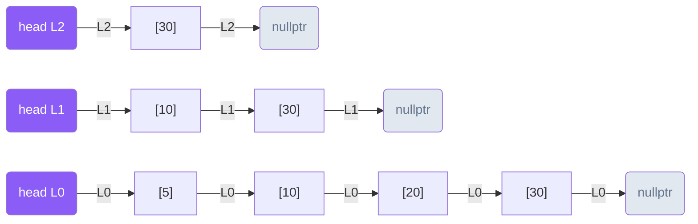
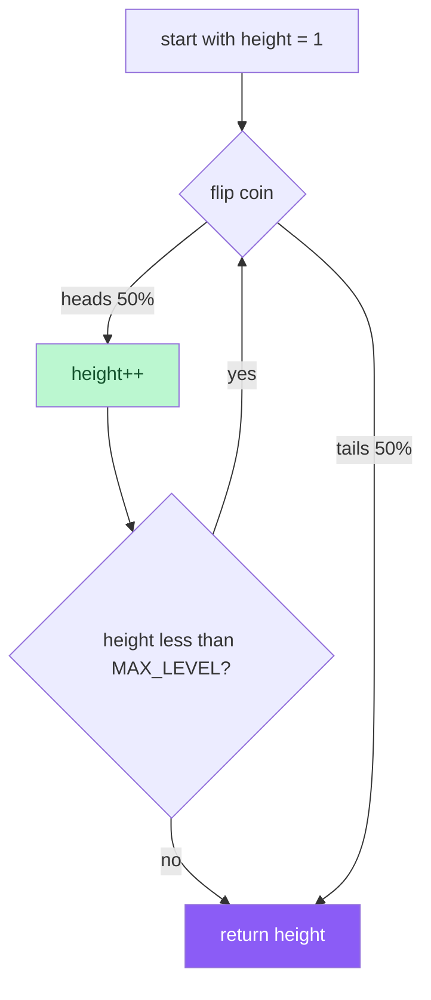
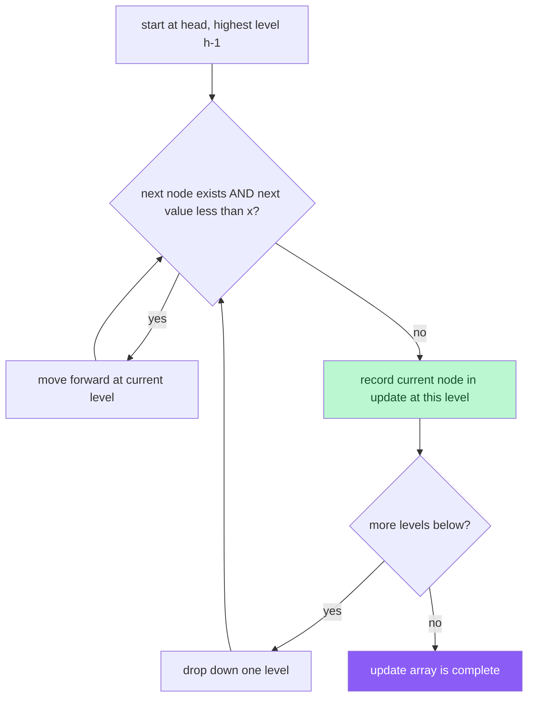
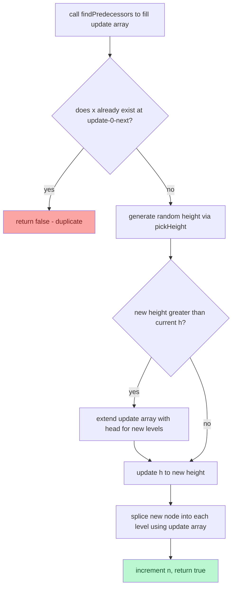
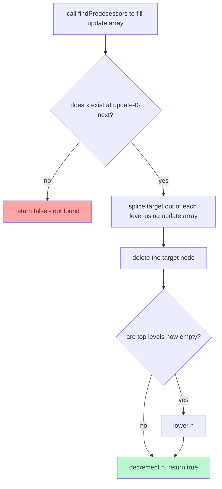
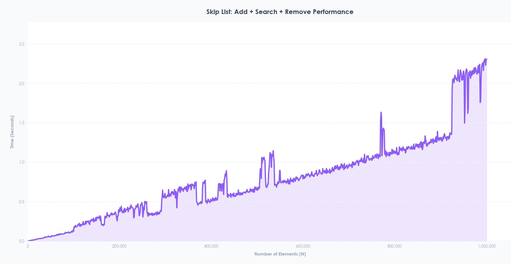

# Skiplist Implementation Guide

### 1. Overview of Skiplist
The `Skiplist` is a concrete Data Structure that implements a Sorted Set (unique elements stored in sorted order) using a probabilistic multi-level linked list as its underlying physical building material. Unlike a standard linked list that only has one level of forward pointers, a Skiplist builds multiple levels of "express lanes" that allow searches, insertions, and deletions to skip over large portions of the list — achieving O(log n) expected time complexity without the complexity of tree rotations.

### 2. Architectural Components
The `Skiplist` relies on a custom node struct for memory management and a strict interface to ensure standardization across different data structures in the repository.

#### A. The `SSet` Interface ([`sset.hpp`](./Interfaces/sset.hpp))
`Skiplist` inherits from a generic template interface class called `SSet<T>`. This interface dictates that any conforming sorted set structure must implement the following core methods:
* `add(T x)`: Adds x to the set. Returns true if added, false if already exists.
* `remove(T x)`: Removes x from the set. Returns true if removed, false if not found.
* `contains(T x)`: Returns true if x is in the set.
* `size()`: Returns the number of elements in the set.

#### B. Node-Based Memory Management ([`skiplist_node.hpp`](./Base_Structures/skiplist_node.hpp))
Instead of a simple `next` pointer, each `SkiplistNode<T>` holds a **vector of next pointers** — one per level the node participates in.
* **Structure:** Each `SkiplistNode` holds a `value` of type `T` and a `std::vector<SkiplistNode<T>*> next` array of forward pointers.
* **Height:** Each node has a randomly assigned height determined at insertion. A node of height 3 participates in levels 0, 1, and 2.
* **Allocation & Cleanup:** Nodes are created with `new SkiplistNode<T>(x, height)` during `add` and freed with `delete` during `remove`. The destructor walks level 0 to free all nodes.

#### C. Basic Structure
A Skiplist with 3 levels looks like this — higher levels act as express lanes that skip over multiple nodes:

```
Level 2:  head ──────────────────────────────> [30] -> nullptr
Level 1:  head ───────────> [10] ────────────> [30] -> nullptr
Level 0:  head -> [5] ───-> [10] -> [20] ────> [30] -> nullptr
```



---

### 3. Deep Dive into `Skiplist` Logic ([`skiplist.cpp`](./Implementations/skiplist.cpp))
The `Skiplist` class maintains four critical variables: a `head` sentinel node (with MAX_LEVEL pointers), an integer `n` (number of elements), an integer `h` (current maximum height in use), and a random number generator for `pickHeight()`.

#### The `pickHeight()` Function
Every new node gets a randomly assigned height. Each additional level is added with 50% probability:



This means roughly 50% of nodes have height 1, 25% have height 2, 12.5% have height 3, and so on — creating a natural pyramid structure.

#### The `findPredecessors(x, update[])` Helper
Before any add or remove, the `update[]` array is filled with the last node visited at each level that comes before x. This is the core search routine:



#### The `add(x)` Operation
Adding a new element splices it into every level it participates in:



#### The `remove(x)` Operation
Removing an element splices it out of every level it participates in:



#### The `contains(x)` Operation
Search traverses from the highest level down, using express lanes to skip ahead:

```
Searching for 20:
Level 2: head -> [30]  → 30 > 20, drop down
Level 1: head -> [10]  → 10 < 20, move forward
         [10] -> [30]  → 30 > 20, drop down
Level 0: [10] -> [20]  → found! return true
```

---

### 4. Key Properties of a Sorted Set
The `Skiplist` enforces these Sorted Set guarantees:
* **No duplicates** — `add` returns false if x already exists
* **Sorted order** — elements are always maintained in ascending order internally
* **Expected O(log n)** — all three operations are logarithmic on average due to the probabilistic level structure

---

### 5. Performance Testing and Benchmarking
To validate the efficiency of the `Skiplist`, the project includes a specialized benchmarking suite.

* **The C++ Benchmark ([`benchmark.cpp`](./Benchmarking/benchmark.cpp)):** The `benchmarkSkiplist` function tests the full add + contains + remove cycle. It loops through `N` elements, starting from 1,000 up to 1,000,000 in increments of 10,000. For each `N`, it adds `N` elements, searches for all `N` elements, then removes all `N` elements, recording the total time using `std::chrono::high_resolution_clock` and outputting as `N,duration`.
* **Live Data Visualization ([`live_graph.py`](./Benchmarking/live_graph.py)):** The data is piped into a Python script via `subprocess.Popen`, animating a live graph of the performance curve as N scales up.

---

### 6. Observed Performance Characteristics
The Skiplist's O(log n) per operation means the total benchmark time for N operations is O(n log n):



* **Smooth growth phase:** Unlike the DLList and SLLQueue, the Skiplist's O(log n) per operation means it scales much better — each doubling of N only adds a small constant amount of extra work per operation.
* **Heap fragmentation phase:** Like all node-based structures, individual node allocation eventually causes memory scattering and cache misses at large N.
* **Comparison with other structures:**

| Structure | Per Operation | Total Benchmark | Cache Friendly |
|---|---|---|---|
| ArrayStack | O(1) amortized | O(n) | ✅ Yes |
| SLLQueue | O(1) | O(n) | ❌ No |
| DLList | O(n) | O(n²) | ❌ No |
| Skiplist | O(log n) expected | O(n log n) | ❌ No |